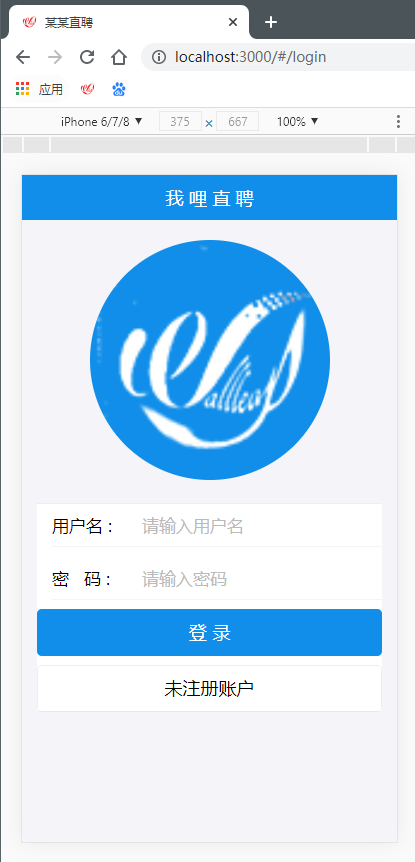

# 某某直聘说明

## 前言

- 说明：

React全栈项目
1) 此项目为一个前后台分离的招聘的 SPA, 包括前端应用和后端应用
2) 包括用户注册/登录, 求职者/老板列表, 实时聊天等模块
3) 前端: 使用 React 全家桶+ES6+Webpack 等技术
4) 后端: 使用 Node + express + mongodb + socketIO 等技术
5) 采用模块化、组件化、工程化的模式开发


- 必备环境：
  - node
  - MongoDB


## 使用

### 1、下载

```
git clone git@github.com:wallleap/Direcruit.git
```


下载之后你能得到两个目录：

- direcruit-client：客户端
- direcruit-server：服务器端


### 2、运行

- 服务器端

```
cd direcruit-server
npm start
```

你能看到这个`db connect success!`，说明服务器端运行成功：

```bash
E:\Git\allProjects\Direcruit\direcruit-server>npm start

> direcruit-server@0.1.0 start E:\Git\allProjects\Direcruit\direcruit-server
> nodemon ./bin/www

[nodemon] 2.0.4
[nodemon] to restart at any time, enter `rs`
[nodemon] watching path(s): *.*
[nodemon] watching extensions: js,mjs,json
[nodemon] starting `node ./bin/www`
(node:25828) DeprecationWarning: current URL string parser is deprecated, and will be removed in a future version. To use the new parser, pass option { useNewUrlParser: true } to MongoClient.connect.
(node:25828) DeprecationWarning: current Server Discovery and Monitoring engine is deprecated, and will be removed in a future version. To use the new Server Discover and Monitoring engine, pass option { useUnifiedTopology: true } to the MongoClient constructor.
db connect success!
```


- 客户端

再开一个命令行窗口

```
cd direcruit-client
npm start
```

默认端口是3000(如果端口被占用，可以选择另一个)，将会自动打开浏览器(如果没有打开，请自动在浏览器中输入http://localhost:3000访问)，显示的是登录界面，如下图



### 3、自定义服务器端口

修改文件`direcruit-server/bin/www:15`

```
var port = normalizePort(process.env.PORT || '5000');
app.set('port', port);
```

我指定的端口号是5000，可以修改为其他端口

由于跨域请求解决方式是用的代理，因此还需要修改文件`direcruit-client/package.json:53`

```
"proxy": "http://localhost:5000"
```


### 4、自定义整体主题

UI库使用的是ant-design-mobile，[全部主题样式参考这里](https://github.com/ant-design/ant-design-mobile/blob/master/components/style/themes/default.less)

修改文件`direcruit-client/antd-theme.json`，例如；

```
{
  "@brand-primary": "#108ee9",
  "@brand-primary-tap": "#0e80d2"
}
```

这个是全局/品牌色中的，你可以继续添加内容(由于是json文件，记得别写注释)

